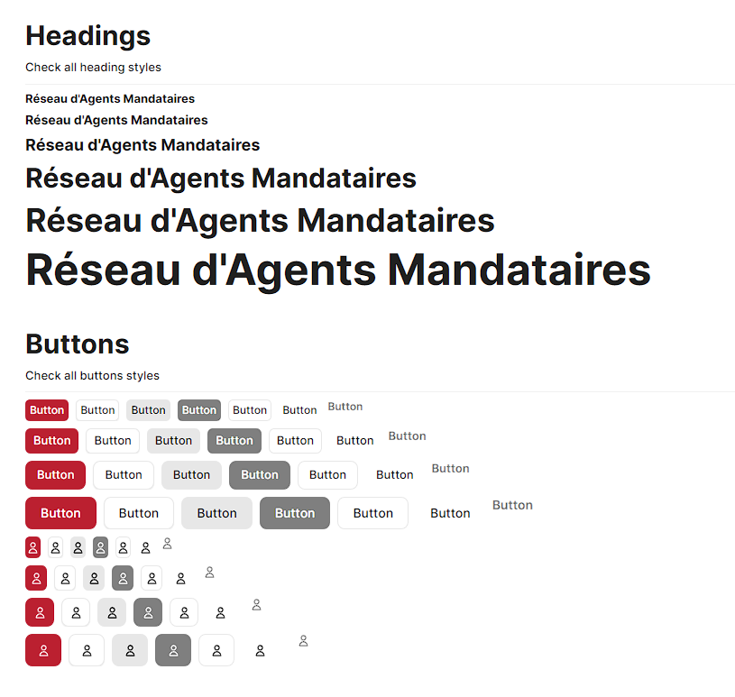

<h1>@sway-ui/sway-ui-theme</h1>
<p>
  
  <a href="#" target="_blank">
    
  </a>
</p>



> Official Sway UI Theme

## Install

```sh
yarn add @sway-ui/sway-ui-theme
```

## Usage

```sh
import { theme } from "@sway-ui/sway-ui-theme";

<ChakraProvider theme={meilleursbiens}>
</ChakraProvider>
```

## Author

👤 **Clément de Louvencourt <clement@meilleursbiens.com>**

* Website: https://cdlv.fr
* Github: [@c-delouvencourt](https://github.com/c-delouvencourt)

## Show your support

Give a ⭐️ if this project helped you!
